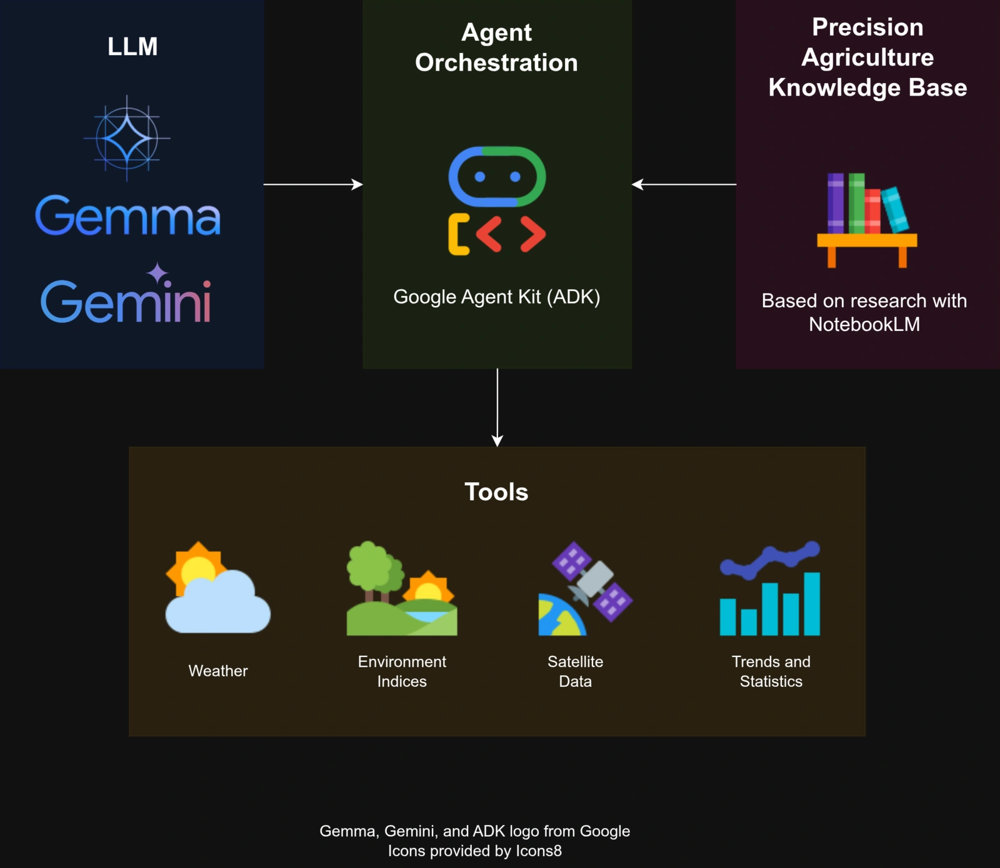
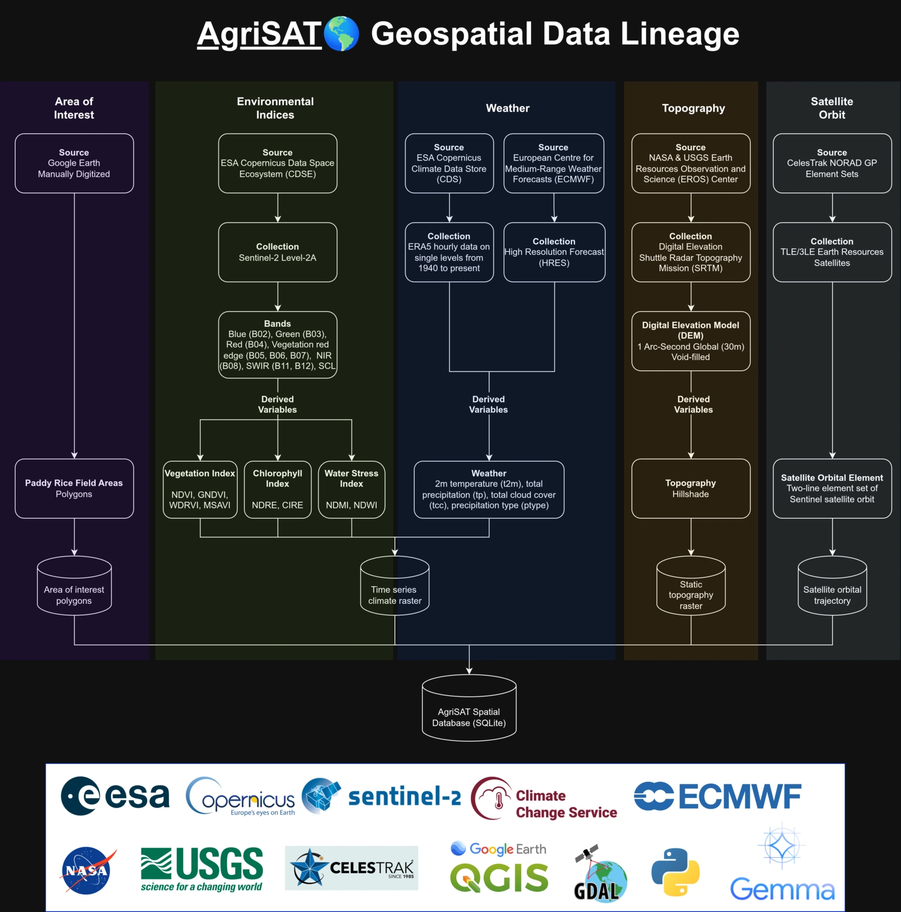

# AgriSAT🌎 Platform

Welcome to AgriSAT!

AgriSAT is a geospatial intelligence platform for precision agriculture. Powered by Gemma 4, AgriSAT offers an end-to-end solution for farmers to monitor, diagnose, and manage their crops more effective and efficiently. Quickly detect problems with crop growth, plan for fertilizer and pesticide application based on weather patterns, and get an accurate agronomic consultation with Gemma 4 agent!

**Main features:**

**Precision agriculture assistant.** Powered by Gemma 4, AgriSAT offers a wide-knowledge of agronomic best practices for farmers. AgriSAT agent is equipped with tools to access rich environmental, weather, and satellite data along with a library of agronomic knowledge distilled from NotebookLM research. These resources give AgriSAT agent a superpower that enables AgriSAT to deliver an accurate recommendation based on real-world conditions.

**Crop monitoring system.** The Sentinel-2 Multi-Spectral Instrument (MSI) data enabled AgriSAT to derive an accurate environmental indices to measure vegetation, chlorophyll, and water stress in farmland across the globe. These indices helps farmers to detect drought, crop stress and diseases.

**Weather prediction.** Weather significantly dictates farmers when to plant crops and apply fertilizer and pesticides. Especially in rice paddy fields where rice require lots of water in the first half of their growing stages.

In this project, we focused our analysis at the Bogor, Jawa Barat, Indonesia region. Currently, providing a nationwide analyses is impossible due to the required storage and compute capabilities.

> See [Glossary](./glossary.md) if you don't understand some words in this documentation.

## Running this Project

First thing first, clone this repository into your local machine. Then, you would need to pick whether to use your own local LLM or use Google Gemini or other AI provider. I recommend using Llama.cpp or Ollama if you want a fully local AgriSAT experience, or use Google Gemini API to access Gemma 4 and other frontier models Google has to offer.

You can download the pre-built AgriSAT Geospatial Database before running the project locally. You can also run the data processing pipeline but it will take time and around 150 GB of storage. Therefore, we recommend you to download the pre-built dataset.

| Dataset                     | Last Updated | Download     |
|-----------------------------|--------------|--------------|
| AgriSAT Geospatial Database | 2026/05/16   | [Google Drive](https://drive.google.com/drive/folders/1-n0zlQabpIg2vSRHrpfYVyTvSp_0Gn_Q?usp=sharing) |

### Using Docker

Docker is the most straightforward way to deploy AgriSAT locally. The included Docker Compose also contains the Ollama server to serve a local Gemma 4 E4B model.

1. Clone the repo
2. Download the AgriSAT Geospatial Database
3. Create environment files
4. Start the containers

Usually, you don't need to change the contents of the environment files. It is ready to use out-of-the-box.

```bash
# clone the repo
git clone https://github.com/fahminlb33/agrisat.git

# change directory to docker
cd docker

# download the AgriSAT Geospatial Database
# and store it here (data.db)

# copy env
cp agent.env.example agent.env
cp api.env.example api.env
cp web.env.example web.env

# start the containers
docker compose up
```

If everything goes smoothly, you can visit the app at [http://localhost:8000](http://localhost:8000).

### Using `uv` and `node`

If you want to run this project manually, you need to have [NodeJS](https://nodejs.org/en/download) and [uv](https://docs.astral.sh/uv/). We assumed you will be running this project in a Linux environment, if you're on Mac or Windows, you should be able to do it too. For each application in this project, you need to run the commands in a separate terminal.

To make the deployment easier, we suggest you to use Gemma from Gemini API. Grab an API key and keep it for now.

First, clone the repo.

```bash
git clone https://github.com/fahminlb33/agrisat.git
```

#### Starting `agrisat-api`

Download and store the AgriSAT Geospatial Database at the `src/agrisat-api` directory!

```bash
cd src/agrisat-api

# you can use the env as-is without modification
cp .env.example .env

# run API server port 3000
fastapi dev --port 3000
```

#### Starting `agrisat-agent`

```bash
cd src/agrisat-agent

# put your GEMINI_API_KEY in the .env
cp .env.example .env

# run ADK server port 8080
python main.py
```

#### Starting `agrisat-web`

```bash
cd src/agrisat-api

# you can use the env as-is without modification
cp .env.example .env

# run web app port 5000
python main.py
```

Now you can visit the web app at [http://localhost:5000](http://localhost:5000).

### Running the project end-to-end

Take a look at the `run-all.sh` in the `src/scripts` directory. It contained the detailed step-by-step process from downloading, preprocessing, and building the AgriSAT Geospatial Database.

## Technical Details

AgriSAT is built upon a two integral components: (1) batch ETL data processing pipeline and (2) React & FastAPI GIS web app.

The data processing pipeline relies heavily on QGIS program to perform geographical modelling and GDAL toolkit to automate the raster data processing. We did all the data processing locally and it required lots of storage space and also compute resource. But don't worry, your average laptop can do it just fine!

Here, we will split the technical discussion into three parts, (1) the Gemma 4 role as precision agriculture assistant, (2) the detailed satellite data processing methodology, and (3) the technology stack.

### Precision agriculture agent with ADK & Gemma 4

The precision agriculture assistant powered by Gemma 4 is the key feature that AgriSAT offers to farmers, policy makers, and researchers. Gemma 4 is the brain that integrates the precision agriculture knowledge, weather, environmental, and satellite data via tools that enabled an accurate and reliable recommendations to the stakeholders. Google Agent Development Kit (ADK) is at the center of the AgriSAT Assistant that orchestrate the whole concert of Gemma 4 and its knowledge base and tools.

In short, the AgriSAT Assistant work as follows:



This combo of Google ADK and Gemma 4 is a match in heaven that unlocks a rapid prototyping of smart AI agentic systems without the complexity of managing sessions, memory, and contexts. A perfect solution for AgriSAT MVP.

You can take a look at the [agent source code here](https://github.com/fahminlb33/agrisat/tree/master/src/agrisat-agent). If you're curious about the agent instructions, you can see the [instruction prompt here](./system-prompt.md).

### The science and ETL pipeline

Now we're entering the science part of AgriSAT. How AgriSAT processes the satellite data and produced the high quality data used for the AI agent to help farmers, policy makers, and researchers.

AgriSAT uses a plethora of data sources and processing methodologies to deliver the highest quality of analysis. Our research starts by digitizing the area of interest (in this case paddy rice fields) using Google Earth. The digitized polygonal area is then exported as KML and further processed in QGIS to create a Shapefile and GeoJSON for visualization in the browser. Next, we collected Sentinel-2 Level-2A dataset. This dataset contained the raster data from the onboard Multi-Spectral Instrument (MSI) that allowed us to derive environmental indices for crop monitoring. We then performed various statistical analyses to get the overall zone/area health at multiple levels (the whole Bogor area, Kota and Kabupaten, administrative area (Kecamatan), and per paddy rice field zones).

Further, we collected historical and forecast weather data from ECMWF which is an integral part for paddy rice cultivation. We also collected digital elevation model (DEM) from NASA to visualize the topography of the area of interest. Lastly, we incorporated satellite orbital data to show where is the Sentinel satellites currently orbiting just for fun!

The overall data processing pipeline is as follows:



To learn more about the details of the data processing pipeline, you can check out the respective [Environmental Data Documentation](./environment.md) and [Weather Data Documentation](./weather.md).

### Tech Stack

How we build AgriSAT? Mainly Python 3.13 for the data analysis, backend, and agentic system and NodeJS and TypeScript for the frontend web app.

Data Analysis:

- [QGIS](https://qgis.org/)
- [GDAL](https://gdal.org/en/stable/)
- [GeoPandas](https://geopandas.org/en/stable/)
- [rioxarray](https://corteva.github.io/rioxarray/stable/)

AgriSAT API:

- [FastAPI](https://fastapi.tiangolo.com/)
- [SQLite](https://sqlite.org/)

AgriSAT Agent:

- [Google Agent Development Kit (ADK)](https://adk.dev/)
- [httpx](https://www.python-httpx.org/)

AgriSAT Web App:

- [React](https://react.dev/)
- [Tanstack Start](https://tanstack.com/start/latest)
- [MapLibre](https://maplibre.org/)
- [Tailwind](https://tailwindcss.com/)
- [Vite](https://vite.dev/)

## Acknowledgment

The author would like to thank:

- the [European Space Agency (ESA) Coprnicus Data Space Ecosystem (CDSE)](https://dataspace.copernicus.eu/data-collections/copernicus-sentinel-missions/sentinel-2) for providing the most needed raster data to monitor vegetation indices,
- the [European Centre for Medium-Range Weather Forecasts (ECMWF)](https://www.ecmwf.int/en/forecasts/datasets/open-data) for providing the global weather forecast,
- the [Copernicus Climate Data Store (CDS)](https://cds.climate.copernicus.eu/datasets/reanalysis-era5-land?tab=download) for providing the ERA5-Land global hourly weather reanalysis data,
- the [United States Geological Survey (USGS)](https://earthexplorer.usgs.gov/) and [National Aeronautics and Space Administration (NASA)](https://www.earthdata.nasa.gov/data/instruments/srtm) for providing the digital elevation model (DEM),
- the [CelesTrak](https://celestrak.org/NORAD/elements/) for providing the NORAD GP Element Sets data to calculate satellite orbit,
- and the [United Nations OCHA Regional Office for Asia and the Pacific (ROAP)](https://data.humdata.org/dataset/cod-ab-idn) for providing the Indonesian subnational administrative boundaries polygon.
